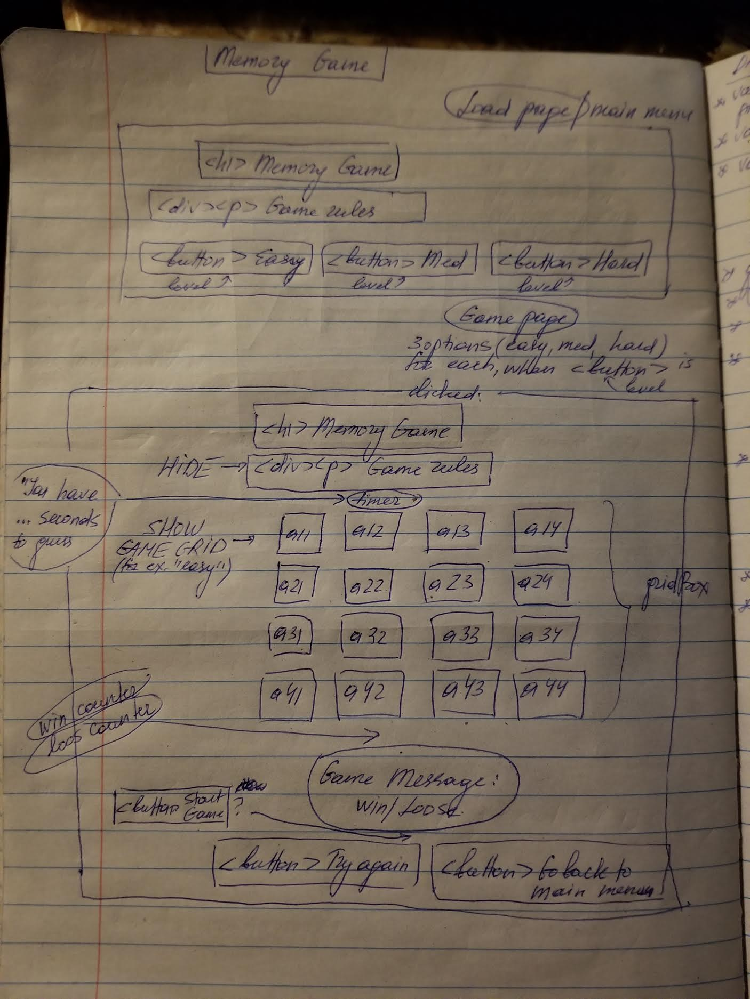

# project1 -- Memory Game
The aim of the memory game is to match all the pairs of pictures on the board within a given interval of time.  If the player matches all the tiles/pictures, they win.  If the player runs out of time and does not uncover all the tiles on the board, they loose.

Play online: 

## Technologies used:
This game was created using HTML, CSS and JavaScript.

## Planning details:
### Wireframe:

I wanted to create a game board consisting of a 4x4 grid of tiles.  In addition to the board, I wanted the game to have a countdown timer, a win/lose message, and two separate win/lose counters.  The timer, the message, and the counters are DOM elements.  The rest of the page elements, including the tile grid are hard-coded into the HTML.

Additionally, there are two buttons -- one to start a new game and the other to reset the board and the win/lose scores.  These buttons, together with the gameboard have event listeners ("click").

Moreover, there is a link at the bottom of the game page that takes the user to the home page, where game instructions are presented.

## Development journal:
At the beginning of the project, my main concern consisted of figuring out a way to randomize the pairs of pictures.  For that purpose, I used Fisher-Yates (or Knuth) Shuffle that I found on stackoverflow.
[stackoverflow link](https://stackoverflow.com/questions/2450954/how-to-randomize-shuffle-a-javascript-array)

Once my pairs of pictures were randomizing properly, I used pop() method to populate my gameboard.  I've added an event listener to my grid, so each time two of the tiles are selected, they are analyzed for match.  For this purpose, I've assigned a letter to each image in my given pictures array to make the comparison -- if the letters match, the images match.  I then used push() method to populate the "guessed" images array with these letters, which I used for my check win condition.  The matched images stay uncovered on the board.  

I've also added a time delay for the unmatched pictures, so that there is a buffer for when unmatched images turn back to their "hidden"/original state.  If the images (letters) don't match, the letters corrensponding to the clicked images are taken out of the "guessed" images array.  

The win conditions -- checkWin() function -- are evaluated inside the event listener function.  If the number of tiles guessed is equal to the total number of tiles on the board (16 for the 4x4 board), the user wins.  However, if when remaining time is equal to zero and there are less than 16 tiles guessed correctly, the user loses the game. 

I then used an endGame() function inside the checkWin() function to update the win/lose messages and win/loss counters, depending on the outcome of the game.

For my timer, I used updateClock() function that kept track of the remaining time and game status -- win or loss.

Clicking a Start Game button initiates startGame() function that resets the timer back to 60 seconds, clears the arrays holding guessed pictures/letters, clears the text content of the game messages, randomizes the gameboard, and sets all the images on the board "face-down."

Clicking a Game Reset button clears win/loss counters and delay and timer handles, in addition to running the startGame() function.

## Remaining issues:
Originally, I was playing on creating two gameboards -- easy and hard.  Both boards were created in HTML and styled in CSS.  However, the CSS for the "hard" version is a little off -- the div containg the grid expands too much, and the grid gaps on the gameboard are inconsistent.  Shortly, it looks off.

The main issue with the versions though is that my app either only runs "easy" version or "hard" version, but not both!  Other than that, the game works.

## Features to add/wishlist:
I would like to fix the issue of not being able to run both versions of the game.  Moreover, I want to add a pop-out box versus a game message that informs the user of their win/loss, total wins/losses, time reamining, etc. and maybe add the "best time" tracker.  I would also like to either blur out or white out the guessed tiles during the gameplay or maybe add some win/lose sounds or some type of animation.
